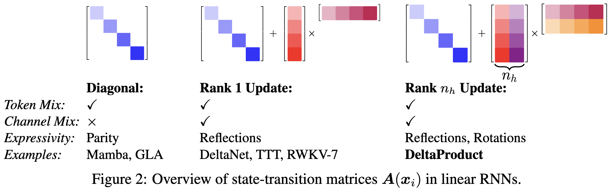

# DeltaProduct: Improving State-Tracking in Linear RNNs via Householder Products
<p align="center">
    
</p>

<p align="center">
    
</p>

[Link to paper](https://arxiv.org/abs/2502.10297)


## Note
This is the code to carry out our experiments, we contributed DeltaProduct to [flash-linear-attention](https://github.com/fla-org/flash-linear-attention) which is the version we will keep updating.

## Abstract
> Linear Recurrent Neural Networks (linear RNNs) have emerged as competitive alternatives to Transformers for sequence modeling, offering efficient training and linear-time inference. However, existing architectures face a fundamental trade-off between expressivity and efficiency, dictated by the structure of their state-transition matrices. Diagonal matrices, used in models such as Mamba, GLA, or mLSTM, yield fast runtime but have limited expressivity. To address this, recent architectures such as DeltaNet and RWKV-7 adopted a diagonal plus rank-1 structure, which allows simultaneous token and channel mixing, improving associative recall and, as recently shown, state-tracking when  allowing negative eigenvalues in the state-transition matrices. Building on the interpretation of DeltaNet's recurrence as performing one step of online gradient descent per token on an associative recall loss, we introduce DeltaProduct, which instead takes multiple ($n_h$) steps per token. This naturally leads to diagonal plus rank- $n_h$ state-transition matrices, formed as products of $n_h$ generalized Householder transformations, providing a tunable mechanism to balance expressivity and efficiency. We provide a detailed theoretical characterization of the state-tracking capability of DeltaProduct in finite precision and how it improves by increasing $n_h$. Our extensive experiments demonstrate that DeltaProduct outperforms DeltaNet in both state-tracking and language modeling, while also showing significantly improved length extrapolation capabilities.

## Acknowledgements
This repository builds upon two key sources:
- [Illusion of State in State-Space Models](https://github.com/jopetty/word-problem). The primary modification in this version is the integration of the DeltaProduct mechanism.
- [Flash-Linear-Attention](https://github.com/fla-org/flash-linear-attention). We leverage the triton implementation of (Gated) DeltaNet in order to implement DeltaProduct.

## Installation
Please install flash-linear attention and the state-tracking folder in your python environment.

For the language modelling experiments you need the following packages installed in your environment: 

```
causal-conv1d
triton>3.1.0
accelerate
transformers
datasets
wandb
```

## Example: Training on Sequences of $S_3$

This section demonstrates how to generate data and run experiments for learning sequences in the symmetric group $S_3$.

### Data Generation

First, generate the training and testing datasets:

**Training Data:**
```
PYTHONPATH=$PWD python src/generate_data.py --group=S3 --k=128 --samples=100000
```

**Test Data:**
```
PYTHONPATH=$PWD python src/generate_data.py --group=S3 --k=512 --samples=100000
```

### Experiment Execution

The following examples illustrate the training process with different configurations of the DeltaProduct. The notation $\text{DeltaProduct}_n[a, b]$ refers to a DeltaProduct configuration with $n$ Householder reflections and an eigenvalue range of $[a, b]$.

#### Configuration 1: $\text{DeltaProduct}_1[-1, 1]$
```
PYTHONPATH=$PWD python src/main.py train --group=S3 --k=128 --k_test=512 --n_layers=1 --epochs=100 --allow_neg_eigval=True --num_householder=1 --batch_size=2048 --seed=666 --lr=1e-3 --n_heads=8 --use_scheduler=True
```

**Outcome:** This configuration is not expected to converge. For $S_3$, a single layer of DeltaProduct requires a minimum of two Householder reflections.

#### Configuration 2: $\text{DeltaProduct}_2[-1, 1]$
```
PYTHONPATH=$PWD python src/main.py train --group=S3 --k=128 --k_test=512 --n_layers=1 --epochs=100 --allow_neg_eigval=True --num_householder=2 --batch_size=2048 --seed=666 --lr=1e-3 --n_heads=8 --use_scheduler=True
```

**Outcome:** This configuration is expected to train successfully.

#### Configuration 3: $\text{DeltaProduct}_1[0, 1]$
```
PYTHONPATH=$PWD python src/main.py train --group=S3 --k=128 --k_test=512 --n_layers=1 --epochs=100 --allow_neg_eigval=False --num_householder=1 --batch_size=2048 --seed=666 --lr=1e-3 --n_heads=8 --use_scheduler=True
```

**Outcome:** This configuration is not expected to converge. Restricting eigenvalues to $[0, 1]$ (`allow_neg_eigval=False`) is unsuitable as negative eigenvalues are required.

#### Configuration 4: $\text{DeltaProduct}_2[0, 1]$
```
PYTHONPATH=$PWD python src/main.py train --group=S3 --k=128 --k_test=512 --n_layers=1 --epochs=100 --allow_neg_eigval=False --num_householder=2 --batch_size=2048 --seed=666 --lr=1e-3 --n_heads=8 --use_
```

**Outcome:** This configuration is not expected to converge. Restricting eigenvalues to $[0, 1]$ (`allow_neg_eigval=False`) is unsuitable as negative eigenvalues are required. 

## Language Modeling

The checkpoints can be downloaded at this [dropbox link](https://www.dropbox.com/scl/fi/6hnrdviv9s4msez67pqnl/checkpoints.zip?rlkey=wsda30n91hi8xlby5tvbpadt0&st=ro5r6mwl&dl=0).

The checkpoints are abbreviated with the following rules: `Model_eigenvalue-range_training-context-length`

For example: `DN_-1_1_4k` is a DeltaNet with negative eigenvalues trained on 4096 token context. 

To reproduce the experiments you will need access to a SLURM cluster to use the training and evaluation scripts.

### Training models

The training script is located in `language_modeling/slurm_scripts/training.sh`. You will have to adapt the parameters of the script to your specific SLURM setup (partition, nodes, `gres`) and the model you wish to train. For this you need to specify the model config (configs are in `language_modeling/model_configs`). 


### Running evaluations

1. `lm-eval` can be run by using the `language_modeling/slurm_scripts/lm_eval_harness_static_evals.sh`
2. To collect length extrapolation losses and perplexities, you can use the `language_modeling /slurm_scripts/length_extrapolation_eval.sh` script. 
3. To collect data on the effective rank you need to first use `language_modeling/custom_evals/collect_activations.sh` to collect the activations and then `/language_modeling/slurm_scripts/run_effective_rank.sh` to get the effective rank plots and data.

